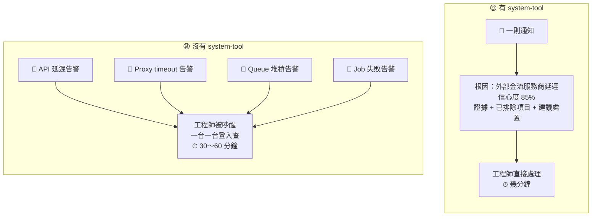
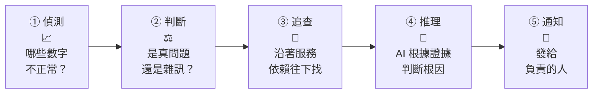
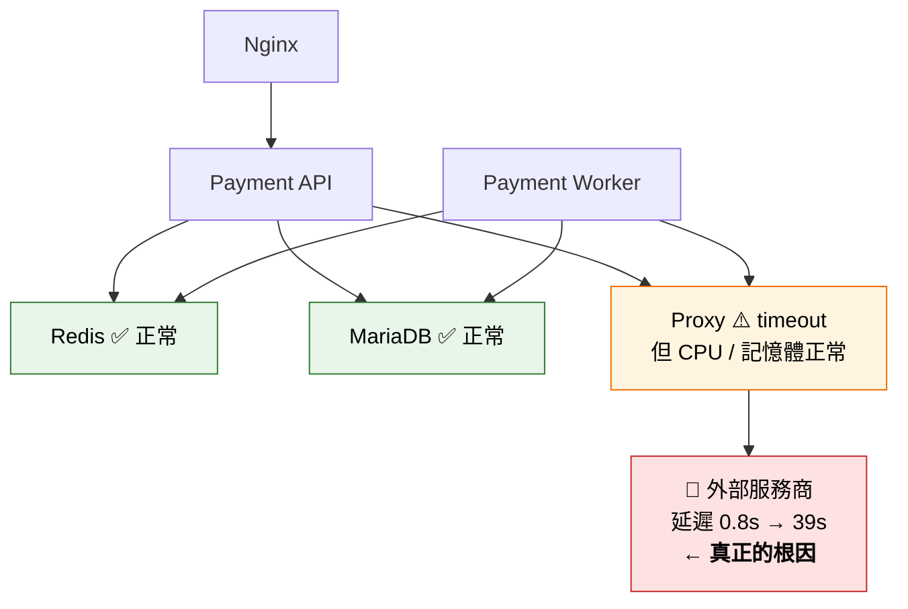
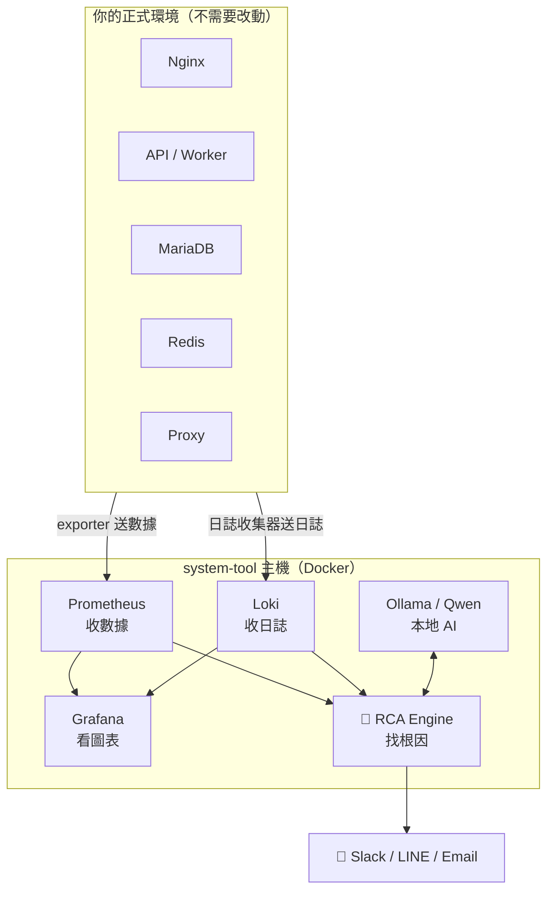
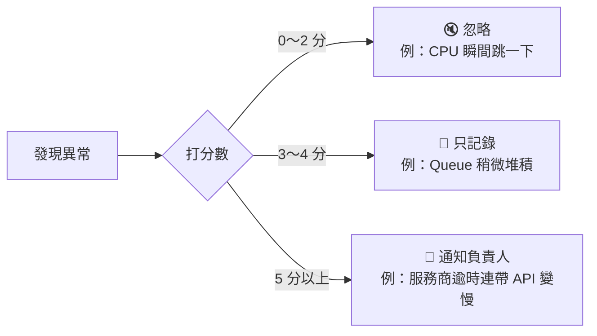
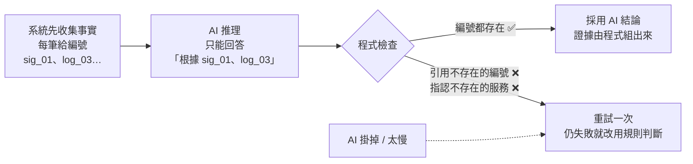
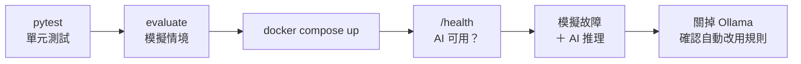
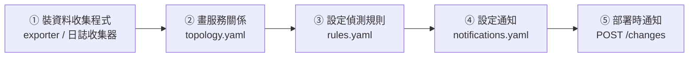
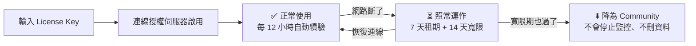
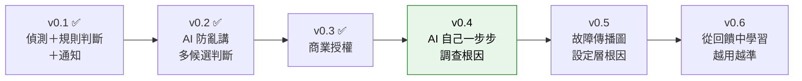

# system-tool

### 系統出問題時，告訴你「**為什麼**」壞掉

> **AI 事故調查與根因分析平台**（AI Incident Investigation & RCA Platform）
>
> 版本 **v0.3.0** · [更新紀錄](CHANGELOG.md) · [流程圖](docs/product-flowcharts.md) · [技術說明](docs/technical-guide.md) · [授權說明](LICENSING.md)

一般監控系統只會告訴你「哪裡異常」；system-tool 會告訴你：

| ❓ 你想知道的 | ✅ system-tool 的回答 |
|---|---|
| 到底哪個元件壞了？ | 「**外部金流服務商**」，不是看起來在報錯的 Proxy |
| 有多確定？ | 信心度 **85%**（高度可能） |
| 憑什麼這樣判斷？ | 列出證據：服務商延遲 0.8 秒 → 39 秒；Proxy CPU 正常 |
| 哪些已經排除了？ | 資料庫正常、Redis 正常 |
| 現在該怎麼做？ | 1. 確認服務商狀態　2. 切換備援通道　3. 降低重試次數 |
| 該通知誰？ | 自動通知 **payment-team** |

---

## 📖 目錄

1. [它解決什麼問題？](#-它解決什麼問題)
2. [它是怎麼找到原因的？](#-它是怎麼找到原因的)
3. [它會放在哪裡？](#-它會放在哪裡)
4. [為什麼不會一直亂發告警？](#-為什麼不會一直亂發告警)
5. [為什麼 AI 不會亂講？](#-為什麼-ai-不會亂講)
6. [5 分鐘快速體驗](#-5-分鐘快速體驗)
7. [完整安裝](#-完整安裝docker)
8. [接上你的系統](#-接上你的系統)
9. [方案與授權](#-方案與授權)
10. [常見問題](#-常見問題)
11. [文件導覽與 Roadmap](#-文件導覽)

---

## 🤔 它解決什麼問題？

用一個真實常見的例子說明：**半夜金流入款大量逾時。**



**最容易誤判的地方：** Proxy 一直報 timeout，大家直覺會以為是 Proxy 壞了。system-tool 會先檢查 Proxy 的 CPU、記憶體是否正常；正常的話，就沿著依賴往下查，最後發現真正異常的是**外部服務商**。Proxy 只是「被連累」。

---

## 🔍 它是怎麼找到原因的？

整個過程分 5 步，每 60 秒自動跑一次：



| 步驟 | 白話說明 |
|---|---|
| ① 偵測 | 定期讀取 Prometheus（數據）和 Loki（日誌），和「平常的樣子」比較，找出異常的數字 |
| ② 判斷 | 單一數字瞬間跳一下不算；要**持續異常**，或**多個相關訊號一起異常**，才算真的事故 |
| ③ 追查 | 依照你設定的「誰依賴誰」，往下游一層一層檢查，同時查日誌、最近的部署和處理手冊 |
| ④ 推理 | 本地 AI（Ollama／Qwen）根據收集到的證據判斷根因；AI 不可用時，自動改用規則判斷 |
| ⑤ 通知 | 依負責團隊和嚴重度，發到 Slack／LINE／Email，附上證據和建議處置 |

### 「沿著依賴往下找」是什麼意思？

你只要描述一次服務之間的關係（`config/topology.yaml`），system-tool 就會照著它追查：



> 原則很簡單：**「自己異常，而且它依賴的東西都正常」的那一個，最可能是根因。** 它上面那些跟著出錯的服務，都只是被連累的「症狀」。

---

## 🏗️ 它會放在哪裡？

system-tool 裝在**你自己的環境**（機房或你的雲端帳號），監控資料不會離開你的環境。被監控的正式主機**不用裝 AI**，只要裝標準的資料收集程式。



**安全承諾：** system-tool 是**唯讀**的。它只查詢數據和日誌，不會重啟服務、不會修改設定，也不會登入你的主機。

---

## 🔕 為什麼不會一直亂發告警？

每個疑似問題都會**打分數**，分數夠高才通知：



| 加分（越像真問題） | 扣分（越像雜訊） |
|---|---|
| 持續超過門檻 5 分鐘 **+2** | 只是瞬間尖峰 **−2** |
| 跟平常比明顯異常 **+1** | 正在維護中 **−5** |
| 嚴重超標（門檻 2 倍以上）**+2** | |
| 多種訊號一起異常（例：延遲＋錯誤率）**+2** | |
| 有依賴關係的服務一起異常 **+2** | |
| 最近 30 分鐘有部署 **+1** | |

同一個事件 30 分鐘內也不會重複通知。

---

## 🛡️ 為什麼 AI 不會亂講？

AI 最大的風險是「講得很有自信，但內容是編的」。system-tool 的做法是：**AI 只能推理，不能自己寫證據。**



另外還有兩道保險：

- AI 指認的元件如果**沒有任何異常證據**，信心度會自動壓到 50% 以下。
- 證據不足時會明確回答 **「unknown（需要人工調查）」**，不會硬掰一個答案。

---

## 🚀 5 分鐘快速體驗

**不需要 Docker，也不需要真的故障。** 內建 11 個模擬故障情境：

```bash
git clone https://github.com/kingchen0617/system-tool.git
cd system-tool/rca-engine
pip install -r requirements.txt

# 模擬一次「外部服務商逾時」
python -m app.cli simulate provider-timeout --no-llm
```

你會看到：

```
🔴 [CRITICAL] INC-20261006-0001
受影響服務：payment-api
可疑元件：provider-api（信心度 85%，高度可能）
根因判斷：External Payment Provider（external）延遲/錯誤率異常，沿依賴鏈影響上游服務：proxy → payment-api、payment-job
證據：
  • provider-api provider-latency: 目前 39.00 (基準 0.8100, z=332.2) 門檻 > 5.00
  • provider-api provider-error-rate: 目前 0.4700 (基準 0.0086, z=85.1) 門檻 > 0.1000
  • proxy proxy-cpu 正常（25.40）→ 非 proxy 本身資源不足
  • payment-api api-cpu 正常（27.54）→ 非 payment-api 本身資源不足
  • payment-job job-queue-depth 正常（298）→ 非 payment-job 本身資源不足
已排除：mariadb、redis
建議處置：
  1. 確認服務商狀態頁，並聯繫服務商技術窗口
  2. 啟用備援服務商或暫時關閉該通道（circuit breaker）
  3. 降低重試次數與並行數，避免 retry storm 拖垮 worker
負責人：payment-team　（推理來源：rule）
```

一次跑完全部情境，看準確率：

```bash
python -m app.cli evaluate --no-llm
# Top-1 準確率：9/9 = 100%　Top-3 準確率：9/9 = 100%　誤報：0/2
```

<details>
<summary>📋 內建的 11 個模擬情境</summary>

| 情境 | 正確答案 |
|---|---|
| `provider-timeout` 外部服務商逾時（Proxy 本身正常） | 外部服務商 |
| `proxy-saturation` Proxy 資源耗盡 | Proxy |
| `db-latency` 資料庫慢查詢暴增 | MariaDB |
| `db-connection-exhaustion` 資料庫連線數耗盡 | MariaDB |
| `db-slow-burn` 資料庫問題已持續 15 分鐘 | MariaDB |
| `redis-latency` Redis 延遲升高 | Redis |
| `deployment-regression` 部署後應用程式出錯 | Payment API（部署回歸） |
| `api-5xx-only-severe` 只有 API 錯誤率暴增 | Payment API |
| `multi-root-redis-db` Redis 和資料庫同時異常 | 列出兩個候選，並降低信心度 |
| `cpu-spike-momentary` CPU 瞬間尖峰 | 不應通知 |
| `queue-backlog-warning` Queue 輕微堆積 | 只記錄，不通知 |

</details>

---

## 🐳 完整安裝（Docker）

```bash
cp .env.example .env                               # 1. 複製設定檔（通知管道、授權等）
docker compose up -d --build                       # 2. 啟動全部服務
docker compose exec ollama ollama pull qwen3:4b    # 3. 第一次下載 AI 模型

# 4. 跑一次完整流程（含 AI 推理）
curl -X POST localhost:8000/test/incident -H 'Content-Type: application/json' \
     -d '{"scenario":"provider-timeout","notify":false}'
```

啟動後可以打開：

| 畫面 | 網址 |
|---|---|
| 🏠 system-tool 首頁（事件列表、授權狀態） | http://localhost:8000 |
| 📘 API 文件 | http://localhost:8000/docs |
| 📊 Grafana（帳密 admin / admin） | http://localhost:3000 |
| 📈 Prometheus | http://localhost:9090 |

> 💡 已經在主機上裝了 Ollama？可以刪掉 `docker-compose.yml` 裡的 `ollama`，並在 `.env` 設定 `OLLAMA_URL=http://host.docker.internal:11434`。

**建議的驗證順序：**



---

## 🔌 接上你的系統



| 步驟 | 要做什麼 | 設定檔 |
|---|---|---|
| ① 收集資料 | 在主機裝 node_exporter、mysqld_exporter、redis_exporter、nginx exporter；日誌用 Promtail／Grafana Alloy 送到 Loki。記得加上 `service` 標籤 | `observability/prometheus/prometheus.yml` |
| ② 服務關係 | 寫下每個服務的負責人、依賴誰、重要程度 | `config/topology.yaml` |
| ③ 偵測規則 | 每條規則一個 PromQL，再設定門檻和持續時間 | `config/rules.yaml` |
| ④ 通知 | 哪個團隊、什麼嚴重度，發到哪個管道 | `config/notifications.yaml` |
| ⑤ 變更關聯 | CI/CD 部署完成後呼叫 API，系統才能判斷「是不是剛部署造成的」 | – |

`topology.yaml` 長這樣，很直觀：

```yaml
- id: payment-api
  name: Payment API (Laravel)
  owner: payment-team          # 出事通知誰
  criticality: P1              # 重要程度
  depends_on: [redis, mariadb, proxy]   # 它依賴誰
```

> ⚠️ 設定完先執行 `python -m app.cli detect --no-llm`，確認沒有規則顯示 `NO DATA`（代表查不到數據，通常是標籤沒對上）。

---

## 💼 方案與授權

system-tool 是**商業授權軟體**，採「裝在你的環境 + 線上授權」。沒有授權時，會以免費的 Community 方案運作。

| | Community | Professional | Business | Enterprise |
|---|:---:|:---:|:---:|:---:|
| 可監控服務數 | 5 | 50 | 200 | 不限 |
| 規則式根因分析 | ✅ | ✅ | ✅ | ✅ |
| AI 根因分析（Ollama／Qwen） | | ✅ | ✅ | ✅ |
| Slack／LINE／Email 通知 | | ✅ | ✅ | ✅ |
| 部署變更關聯、維護時段 | | ✅ | ✅ | ✅ |
| 工程師回饋資料集、歷史事件檢索 | | | ✅ | ✅ |
| 雲端 AI、AWS、SSO、高可用 | | | | ✅ |
| 離線授權（不需連網） | | | | ✅ |



```bash
python -m app.cli license activate ST1.xxxx...   # 啟用
python -m app.cli license status                 # 查看狀態
```

詳細說明見 [LICENSING.md](LICENSING.md)，授權條款見 [LICENSE](LICENSE) 與 [EULA](EULA.md)，第三方元件授權見 [THIRD_PARTY_NOTICES.md](THIRD_PARTY_NOTICES.md)。

---

## ❓ 常見問題

<details>
<summary><b>會把我的監控資料傳出去嗎？</b></summary>

不會。AI 跑在你自己的主機上（Ollama）。授權續驗只會傳送授權編號、主機識別碼和版本，**不含任何監控資料**。使用量統計（服務數、事件數）要你自己開啟 `TELEMETRY_OPT_IN=true` 才會傳。
</details>

<details>
<summary><b>AI 掛掉或太慢怎麼辦？</b></summary>

會自動改用規則式判斷，監控不會中斷。可以用 `docker compose stop ollama` 再跑一次模擬情境來驗證。
</details>

<details>
<summary><b>會不會自動幫我重啟服務或改設定？</b></summary>

不會。目前完全唯讀，只提供建議處置，由工程師決定是否執行。「人工核准後自動處置」列在 Roadmap 上。
</details>

<details>
<summary><b>它跟 Grafana、夜鶯這類監控系統有什麼不同？</b></summary>

那些系統負責「看見問題」（哪裡異常）；system-tool 負責「理解問題」（為什麼異常、哪個才是根因、證據是什麼）。它可以讀取你現有的 Prometheus／Loki 資料，不需要換掉原本的監控。詳見 [產品定位與流程圖](docs/product-flowcharts.md)。
</details>

<details>
<summary><b>判斷錯了怎麼辦？</b></summary>

每次判斷都會附上證據、已排除項目和其他候選，方便人工確認。工程師可以透過 `POST /incidents/{id}/feedback` 回報對錯和真正的原因，系統會累積成資料集，讓之後判斷得更準（Business 方案以上）。
</details>

---

## 📚 文件導覽

| 文件 | 內容 | 適合誰 |
|---|---|---|
| [docs/product-flowcharts.md](docs/product-flowcharts.md) | 產品定位、目標架構、六大差異化流程圖 | 主管、客戶、合作夥伴 |
| [docs/technical-guide.md](docs/technical-guide.md) | 根因演算法、評分細節、API 清單、輸出格式、專案結構 | 開發者、導入工程師 |
| [LICENSING.md](LICENSING.md) | 授權機制、授權伺服器架設、簽發授權 | 你（賣方）、客戶 IT |
| [CHANGELOG.md](CHANGELOG.md) | 各版本更新內容 | 所有人 |

### Roadmap



---

<sub>© 2026 [授權方名稱]. All rights reserved. 本軟體為專有軟體，未經授權不得重製、散布或使用。</sub>
