# system-tool 產品流程圖

> 圖表用 Mermaid 繪製，GitHub 會直接渲染。
>
> **一句話說明：** 系統出問題時，system-tool 告訴你「**為什麼**異常、真正故障在哪、證據是什麼、下一步怎麼處理」。
>
> 產品名稱：**AI Incident Investigation & RCA Platform**

## 目錄

1. [處理一個事故的流程](#1-處理一個事故的流程)
2. [目標架構（五層）](#2-目標架構五層)
3. [能力 ①：AI 調查迴圈（Agentic Investigation）](#3-能力-ai-調查迴圈agentic-investigation)
4. [能力 ②：假設引擎（Hypothesis Engine）](#4-能力-假設引擎hypothesis-engine)
5. [能力 ③：故障傳播圖（Failure Propagation Graph）](#5-能力-故障傳播圖failure-propagation-graph)
6. [能力 ④：設定層 RCA（Configuration RCA）](#6-能力-設定層-rcaconfiguration-rca)
7. [能力 ⑤：變更關聯（Change Intelligence）](#7-能力-變更關聯change-intelligence)
8. [能力 ⑥：RCA 學習迴圈](#8-能力-rca-學習迴圈)
9. [目前已實作的處理流程](#9-目前已實作的處理流程)
10. [Roadmap](#10-roadmap)

---

## 1. 處理一個事故的流程

system-tool 的工作是 **Understand → Diagnose → Resolve**：理解異常、診斷根因、給出處置建議。

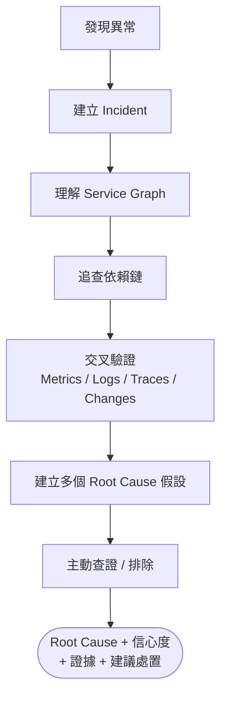

---

## 2. 目標架構（五層）

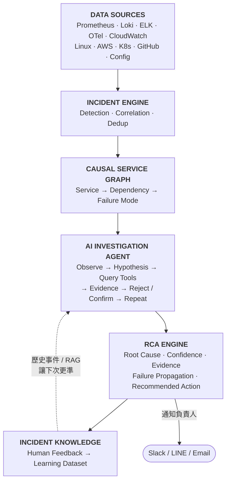

---

## 3. 能力 ①：AI 調查迴圈（Agentic Investigation）

AI 要會「調查」：自己決定下一步查什麼，而不是只讀一次資料就下結論。

- **目前：** 收集資料 → 一次把 context 丟給 Qwen → Qwen 判斷。
- **目標：** AI 自己決定「下一步要查什麼，才能證明或推翻我的假設」，並留下完整的調查紀錄（Investigation Trail）。

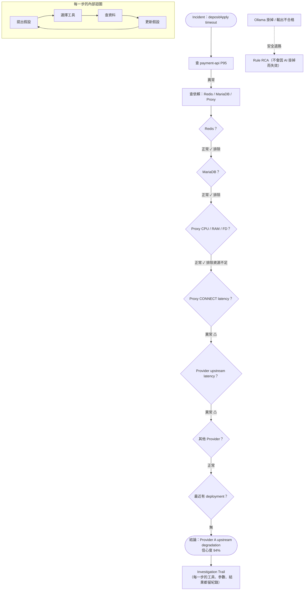

---

## 4. 能力 ②：假設引擎（Hypothesis Engine）

不直接說「Root Cause = Proxy」，而是先列出多個假設，再用證據逐步更新機率。

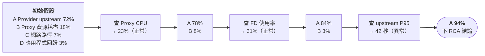

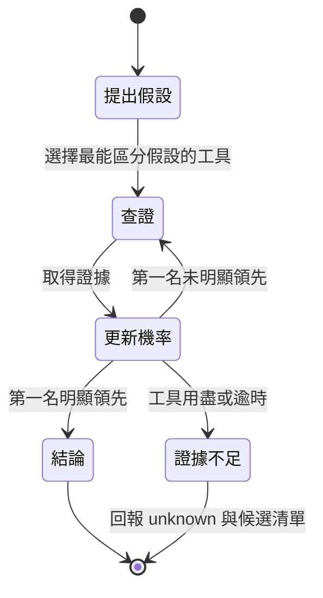

---

## 5. 能力 ③：故障傳播圖（Failure Propagation Graph）

現在的拓撲只有 `depends_on`，也就是「A 依賴 B」。目標是加上 **failure_modes**，讓系統理解「B 用什麼方式故障時，A 會出現什麼症狀」。

```yaml
# 規劃中的 topology 擴充（v0.5）
payment-api:
  depends_on: [redis, mariadb, proxy]
  failure_modes:
    redis:   [timeout, connection_error]
    mariadb: [connection_exhaustion, slow_query, lock_wait]
    proxy:   [connect_timeout, tls_error, fd_exhaustion]
```

**Cause → Propagation → Symptom** 範例：

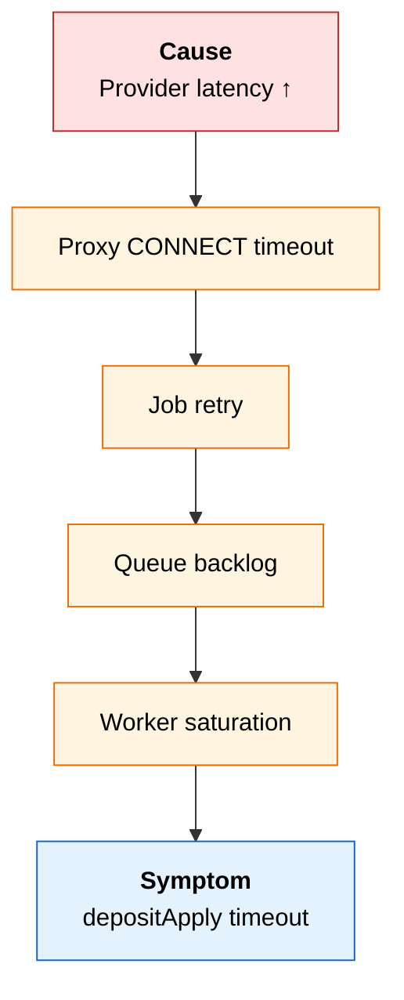

---

## 6. 能力 ④：設定層 RCA（Configuration RCA）

產品核心要求：**不能只說「Proxy timeout」，要分辨是資源不足、設定錯誤、軟體限制，還是上游問題。**

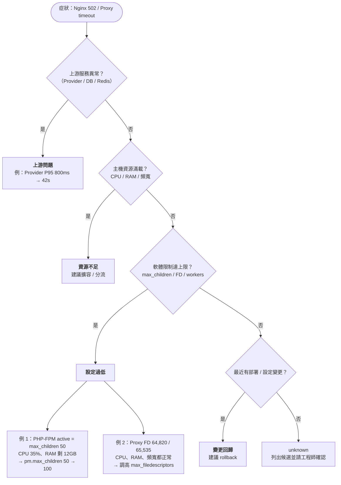

---

## 7. 能力 ⑤：變更關聯（Change Intelligence）

很多事故來自部署、設定、防火牆、DB schema、套件更新或基礎設施變更。system-tool 會把**變更**和**症狀**排成時間軸，判斷兩者的因果關係。

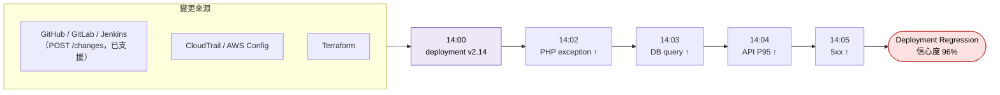

---

## 8. 能力 ⑥：RCA 學習迴圈

每次事故結束後，請工程師確認 AI 判斷得對不對。累積下來的資料，會讓之後的判斷越來越準。

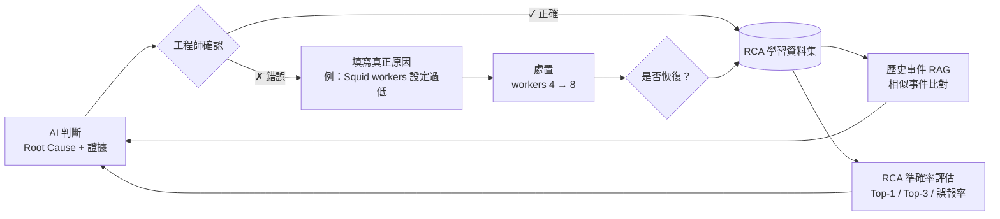

資料集內容：Symptoms ＋ Topology ＋ Metrics ＋ Logs ＋ Configuration ＋ Changes ＋ AI Hypothesis ＋ Actual Root Cause ＋ Engineer Action ＋ Recovery Result。

> 目前已有 `POST /incidents/{id}/feedback` 收集回饋；評估工具是 `python -m app.cli evaluate`。

---

## 9. 目前已實作的處理流程

這張圖是**現在程式實際的運作方式**，方便和上面的目標架構對照。

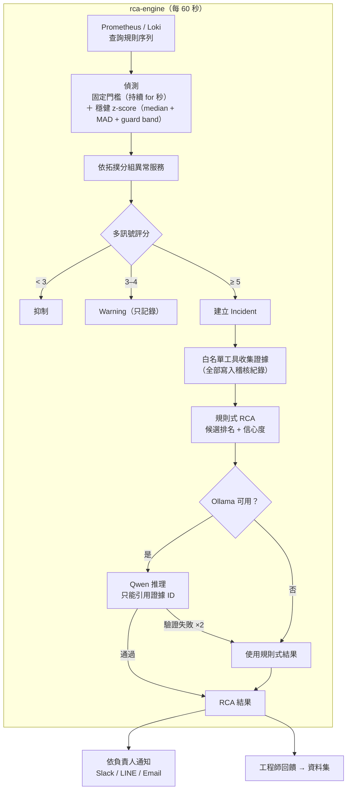

---

## 10. Roadmap

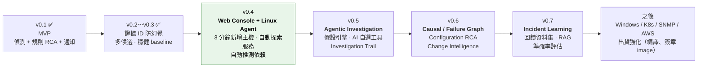

v0.4 詳細規格見 [web-console-spec.md](web-console-spec.md)。

**Demo 目標：** 現場丟一個故障給系統，讓客戶看著 system-tool 一步一步查到根因。
