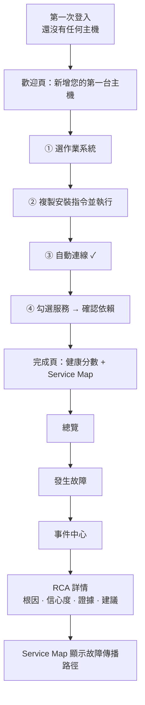
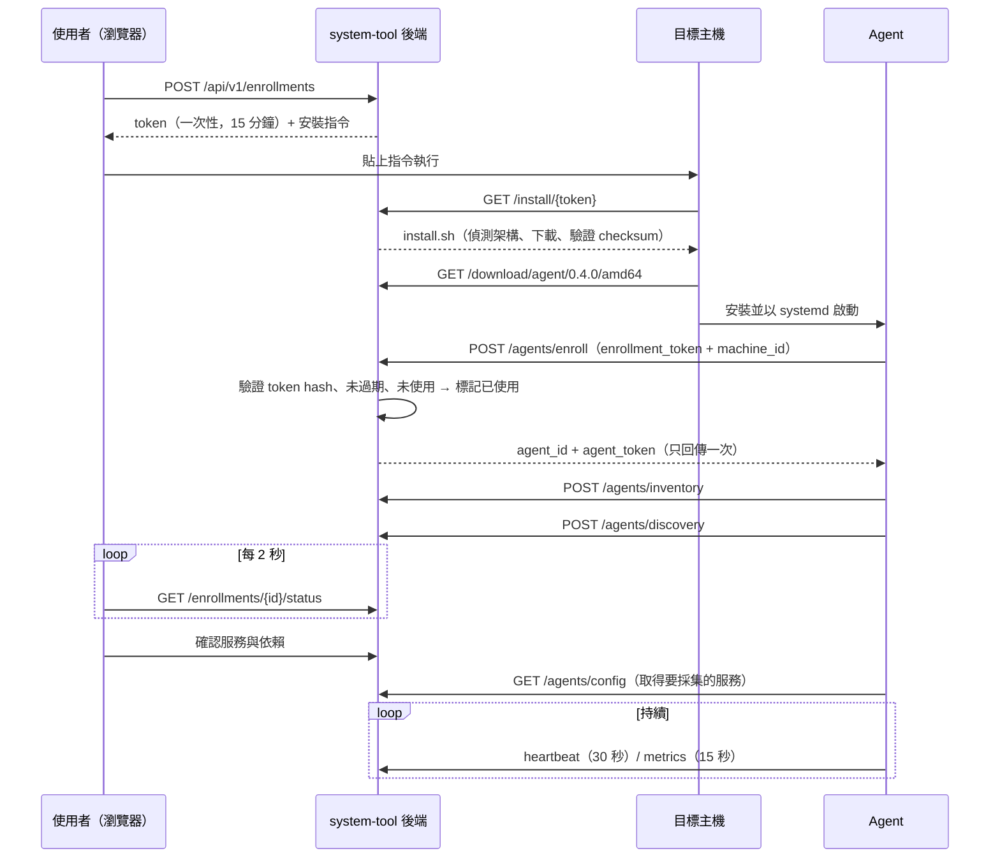

# system-tool v0.4 規格：Web Console 與 Linux Agent

> 文件狀態：定稿草案（與 ChatGPT 討論後整理）
> 目標版本：v0.4
> 核心目標：**3 分鐘內新增第一台 Linux 主機**，而且整個過程不用懂 Prometheus、Exporter、YAML。

---

## 目錄

1. [目標與驗收標準](#1-目標與驗收標準)
2. [範圍：要做與不做](#2-範圍要做與不做)
3. [技術決策](#3-技術決策)
4. [資訊架構與左側選單](#4-資訊架構與左側選單)
5. [使用者旅程](#5-使用者旅程)
6. [頁面 Wireframe](#6-頁面-wireframe)
7. [前端技術選型與目錄結構](#7-前端技術選型與目錄結構)
8. [後端 API](#8-後端-api)
9. [資料模型](#9-資料模型)
10. [Enrollment 與 Agent 認證流程](#10-enrollment-與-agent-認證流程)
11. [Agent：服務探索與依賴推測](#11-agent服務探索與依賴推測)
12. [Agent 權限邊界](#12-agent-權限邊界)
13. [開發里程碑](#13-開發里程碑)
14. [之後的版本](#14-之後的版本)

---

## 1. 目標與驗收標準

### 1.1 目標

不熟悉 Prometheus／Exporter／YAML 的使用者，第一次打開 system-tool 就能：

1. 按「新增主機」
2. 選作業系統
3. 複製一行指令，貼到主機上執行
4. 看到主機自動連線
5. 勾選系統自動找到的服務
6. 確認系統推測的服務依賴
7. 馬上看到這台主機和服務的健康狀態，以及 Service Map

使用者實際要做的事只有：**選 OS → 複製 → 貼上 → 確認**。

### 1.2 驗收標準（P0）

在一台乾淨、受支援的 Linux 主機上（沒有預先裝 Prometheus 或任何 Exporter）：

| # | 驗收項目 |
|---|----------|
| 1 | 從按下「新增主機」到出現健康狀態，正常網路下 **3 分鐘內完成** |
| 2 | 整個過程不需要手寫 YAML、PromQL，也不用改任何設定檔 |
| 3 | 支援 Ubuntu 20.04+／Debian 11+／RHEL 8+ 系列（含 Rocky、Alma），amd64 與 arm64 |
| 4 | 能自動找到 Nginx、PHP-FPM、MariaDB／MySQL、Redis、Squid 中實際存在的服務 |
| 5 | 能根據實際 TCP 連線推測服務依賴，並畫進 Service Map |
| 6 | 主機上看得到 CPU、記憶體、磁碟、網路與各服務狀態 |
| 7 | Enrollment Token 只能用一次，預設 15 分鐘失效，資料庫只存 hash |
| 8 | Agent 為唯讀：不能執行遠端指令、不能重啟服務、不能改設定 |
| 9 | 新增進來的服務會自動進入既有的偵測與 RCA 流程（產生 Incident、RCA 詳情可看） |

---

## 2. 範圍：要做與不做

### 2.1 v0.4 要做

| 類別 | 內容 |
|------|------|
| Agent | Go 寫的 Linux Agent，單一執行檔，amd64／arm64，以 systemd 服務執行 |
| 安裝 | 一次性 Enrollment Token + 一行安裝指令 |
| 認證 | 註冊後發 `agent_id` + `agent_token`（伺服器只存 hash），走 HTTPS |
| 探索 | 用 process + port + systemd + config 多重特徵找服務，使用者勾選要監控哪些 |
| 依賴 | 以實際 TCP 連線為主推測依賴，使用者確認或修改 |
| 狀態更新 | 前端先用 polling（每 2 秒），之後再換 SSE |
| 前端 | 五個核心頁面：新增主機引導 + 主機詳情、Overview、Service Map、Incident Center、RCA 詳情 |

### 2.2 v0.4 不做（延到之後）

- mTLS 裝置憑證
- Windows Agent
- SNMP 網路設備
- AWS／Azure 等雲端帳號匯入
- SSH 無 Agent 模式
- 批次新增，以及 Ansible／Terraform／Helm 部署範本
- Docker／K8s 專屬安裝方式（v0.4 只會在探索結果中「看到」Docker 容器，不做容器內服務監控）
- WebSocket／SSE 即時推送
- 獨立的 Metrics／Logs／Traces 頁面（這些資料先放在主機詳情與 RCA 詳情裡）
- 多使用者、角色權限（v0.4 沿用單一管理者 Token）

---

## 3. 技術決策

### 3.1 Agent 直接用 Go，不先做 Python 版

Enrollment、systemd、跨發行版、process／socket 探索、amd64／arm64、低資源占用、之後的自動更新，都是 Agent 的核心能力。先用 Python 驗證，之後幾乎一定要重寫一次，所以直接用 Go：

- 單一靜態執行檔，不依賴客戶主機上的 Python 版本
- 記憶體目標 < 50 MB，CPU 平均 < 1%
- 交叉編譯 amd64／arm64 很簡單

### 3.2 前端放同一個 repo 的 `web/`

目前 Agent、FastAPI、前端 API 契約會一起頻繁修改，同一個 repo 最容易做到「一個 PR 改完三邊」、一起打版本標籤、一起跑整合測試。之後團隊或發布週期分開時再拆。

### 3.3 Agent 自己採集指標，不要求客戶裝 Exporter

v0.4 的 Agent 直接讀 `/proc`、`/sys` 與服務自身的狀態介面（例如 Nginx `stub_status`、Redis `INFO`、PHP-FPM status page），換算成指標後上傳。後端把這些指標寫進現有的 Prometheus（remote write），讓既有的偵測與 RCA 不用改。

Agent 的 API 不暴露 Prometheus 概念（不會有 `/exporter/register` 之類的 API），之後底層要換 OTel、VictoriaMetrics 或其他時序資料庫，前端和 Agent 協定都不用改。

### 3.4 監控設定由系統自動產生

使用者勾選服務後，系統依「監控設定檔（Monitoring Profile）」自動套用要收的指標與偵測規則：

| 設定檔 | 主要指標 |
|--------|----------|
| `linux-base` | CPU、記憶體、磁碟、網路、load、file descriptor |
| `nginx` | 請求量、5xx 比例、連線數、upstream 延遲 |
| `php-fpm` | active／idle process、max children 觸頂次數、slow requests |
| `mariadb` | 連線數、慢查詢、鎖等待、QPS、buffer pool |
| `redis` | 指令延遲、記憶體、連線數、evicted keys |
| `squid` | 請求量、錯誤率、連線數、file descriptor |

`config/rules.yaml` 之後會從「使用者手寫」轉為「系統內建的知識包」，手寫仍然支援，用於進階客製。

---

## 4. 資訊架構與左側選單

```text
system-tool
│
├─ 總覽（Overview）                P0
│
├─ 事件
│   ├─ 事件中心（Incident Center） P0
│   └─ RCA 詳情                     P0（從事件中心進入）
│
├─ 服務
│   └─ Service Map                  P0
│
├─ 基礎設施
│   └─ 主機（Hosts）                P0
│       ├─ ＋ 新增主機              P0 ★
│       └─ 主機詳情                 P0
│
└─ 設定
    ├─ 通知管道
    └─ 系統設定
```

頂部列只放：環境名稱、未處理事件數（鈴鐺）、使用者選單。**不顯示任何授權或方案資訊。**

---

## 5. 使用者旅程



---

## 6. 頁面 Wireframe

### 6.1 首次使用（沒有主機時的總覽）

```text
┌──────────────────────────────────────────────────────────────┐
│ system-tool                                   🔔 0   Admin ▾ │
├────────────┬─────────────────────────────────────────────────┤
│ 總覽       │                                                 │
│ 事件中心   │            歡迎使用 system-tool                 │
│ Service Map│                                                 │
│ 主機       │       新增第一台主機，約 3 分鐘即可開始監控     │
│ 設定       │                                                 │
│            │               [ ＋ 新增主機 ]                   │
│            │                                                 │
│            │       或先用模擬故障體驗：[ 執行示範情境 ]      │
└────────────┴─────────────────────────────────────────────────┘
```

「執行示範情境」呼叫既有的 `POST /test/incident`，讓還沒有主機的人也能先看到 RCA 詳情長什麼樣子。

### 6.2 新增主機 Step 1／4：選作業系統

```text
┌──────────────────────────────────────────────────────────┐
│ 新增主機                                   Step 1 / 4  × │
│                                                          │
│ 您的主機是哪一種系統？                                   │
│                                                          │
│  ┌────────────┐   ┌────────────┐                         │
│  │   Ubuntu   │   │    RHEL    │                         │
│  │   Debian   │   │ Rocky/Alma │                         │
│  └────────────┘   └────────────┘                         │
│                                                          │
│  CPU 架構：(●) 自動偵測  ( ) amd64  ( ) arm64            │
│                                                          │
│  ── 即將支援 ───────────────────────────────────         │
│  Windows · Docker · Kubernetes · SSH · SNMP · AWS        │
│  （灰色不可點，hover 顯示「之後的版本支援」）            │
│                                                          │
│                                          [ 下一步 → ]    │
└──────────────────────────────────────────────────────────┘
```

這一步不問 IP、Port、Prometheus URL，這些全部由 Agent 自動回報。

### 6.3 新增主機 Step 2／4：複製安裝指令

```text
┌──────────────────────────────────────────────────────────┐
│ 新增主機                                   Step 2 / 4  × │
│                                                          │
│ ① 用 SSH 登入您的主機                                    │
│ ② 複製下面這行指令並執行（需要 sudo）                     │
│                                                          │
│ ┌──────────────────────────────────────────────────────┐ │
│ │ curl -fsSL https://<console>/install/et_XXXX | sudo  │ │
│ │ bash                                        [ 複製 ] │ │
│ └──────────────────────────────────────────────────────┘ │
│                                                          │
│ 指令有效時間：14:32　　[ 重新產生 ]                       │
│                                                          │
│ ◌ 等待主機連線中…                                        │
│                                                          │
│ ▸ 指令做了什麼？（展開說明：下載 Agent、驗證檔案         │
│   checksum、建立 system-tool-agent 服務、啟動）          │
│ ▸ 主機無法連到外網？（顯示離線安裝方式）                 │
└──────────────────────────────────────────────────────────┘
```

- 指令中的 `et_XXXX` 是**一次性 Enrollment Token**，不是永久憑證。
- 前端每 2 秒查一次 `GET /api/v1/enrollments/{id}/status`。
- Token 到期時畫面變成「指令已失效」，提供「重新產生」按鈕。

### 6.4 新增主機 Step 3／4：連線成功

```text
┌──────────────────────────────────────────────────────────┐
│ 新增主機                                   Step 3 / 4  × │
│                                                          │
│ ✓ 已收到安裝請求                                         │
│ ✓ Agent 已註冊                                           │
│ ◌ 正在掃描主機上的服務…                                  │
│                                                          │
│ ┌──────────────────────────────────────────────────────┐ │
│ │ 主機名稱   api-prod-01                               │ │
│ │ IP         10.0.1.25                                 │ │
│ │ 系統       Ubuntu 22.04 (amd64)                      │ │
│ │ CPU        8 核心　　記憶體 32 GB　　磁碟 200 GB     │ │
│ │ Agent      v0.4.0                                    │ │
│ └──────────────────────────────────────────────────────┘ │
│                                                          │
│                              （掃描完成後自動進下一步）  │
└──────────────────────────────────────────────────────────┘
```

### 6.5 新增主機 Step 4／4：勾選服務 + 確認依賴

**4-a 勾選服務**

```text
┌──────────────────────────────────────────────────────────┐
│ 新增主機                                   Step 4 / 4  × │
│                                                          │
│ 在 api-prod-01 上找到 5 個服務：                         │
│                                                          │
│ ☑ Nginx 1.24        :80 :443      可信度 99%             │
│ ☑ PHP-FPM 8.3       :9000         可信度 97%             │
│ ☑ Redis 7.2         :6379         可信度 99%             │
│ ☑ MariaDB 10.11     :3306         可信度 98%             │
│ ☑ Squid 6           :3128         可信度 95%             │
│                                                          │
│ 其他：Docker（4 個容器，v0.4 僅列出，不監控）            │
│                                                          │
│ 負責團隊（選填）：[ payment-team        ▾ ]              │
│                                                          │
│ [ 沒看到我的服務？手動新增 ]           [ 下一步 → ]      │
└──────────────────────────────────────────────────────────┘
```

**4-b 確認依賴**

```text
┌──────────────────────────────────────────────────────────┐
│ 我們推測的服務關係                                       │
│                                                          │
│            Nginx                                         │
│              │                                           │
│              ▼                                           │
│           PHP-FPM ──────────► Squid ──► 外部服務         │
│           │     │                    (203.0.113.10:443)  │
│           ▼     ▼                                        │
│        Redis  MariaDB                                    │
│                                                          │
│ 關係                     來源            可信度          │
│ Nginx → PHP-FPM          設定檔 + 連線   99%   [✓][✕]    │
│ PHP-FPM → Redis          實際連線        96%   [✓][✕]    │
│ PHP-FPM → MariaDB        實際連線        97%   [✓][✕]    │
│ PHP-FPM → Squid          實際連線        93%   [✓][✕]    │
│ Squid → 外部服務         實際連線        90%   [✓][✕]    │
│                                                          │
│ [ ＋ 新增關係 ]                     [ 全部確認，開始監控 ]│
└──────────────────────────────────────────────────────────┘
```

每條關係都標出「來源」，讓使用者知道是觀察到的、設定檔推得的，還是手動加的，不假裝系統永遠正確。

### 6.6 完成頁

```text
┌──────────────────────────────────────────────────────────┐
│ ✓ api-prod-01 已開始監控                                 │
│                                                          │
│   健康分數  96  健康                                     │
│                                                          │
│   CPU 22% ✓   記憶體 41% ✓   磁碟 38% ✓   網路 正常 ✓   │
│                                                          │
│   Nginx 健康 · PHP-FPM 健康 · Redis 健康                 │
│   MariaDB 健康 · Squid 健康                              │
│                                                          │
│   [ 查看主機 ]   [ 查看 Service Map ]   [ 再新增一台 ]   │
└──────────────────────────────────────────────────────────┘
```

> 剛加入時還沒有歷史基準，前 30 分鐘的異常判斷只用固定門檻，畫面上標示「正在學習平常的樣子」。

### 6.7 總覽（Overview）

```text
┌────────────┬─────────────────────────────────────────────────┐
│ 總覽       │ 系統健康                                        │
│            │  健康 42    注意 3    嚴重 1     主機 12        │
│            │                                                 │
│            │ ┌─── Service Map（縮圖，點擊放大）────────────┐ │
│            │ │ Nginx → PHP-FPM ─┬→ Redis ✓                 │ │
│            │ │                  ├→ MariaDB ✓               │ │
│            │ │                  └→ Squid ⚠ → 外部服務 🔴   │ │
│            │ └─────────────────────────────────────────────┘ │
│            │                                                 │
│            │ 進行中事件                                      │
│            │  🔴 外部服務延遲異常   payment-api   85%  3 分前│
│            │  🟠 MariaDB 連線數偏高 mariadb       72% 12 分前│
│            │                                                 │
│            │ 主機狀態                                        │
│            │  api-prod-01  ✓   db-prod-01  ✓   proxy-01  ⚠  │
└────────────┴─────────────────────────────────────────────────┘
```

### 6.8 主機列表與主機詳情

**主機列表**

```text
主機                                              [ ＋ 新增主機 ]
┌──────────────┬────────────┬──────────┬────────┬──────────────┐
│ 主機名稱     │ IP         │ 系統     │ 狀態   │ 最後回報     │
├──────────────┼────────────┼──────────┼────────┼──────────────┤
│ api-prod-01  │ 10.0.1.25  │ Ubuntu   │ ✓ 健康 │ 5 秒前       │
│ db-prod-01   │ 10.0.2.10  │ Rocky 9  │ ✓ 健康 │ 8 秒前       │
│ proxy-01     │ 10.0.3.5   │ Debian   │ ⚠ 注意 │ 3 秒前       │
│ old-web-02   │ 10.0.1.40  │ Ubuntu   │ ✕ 離線 │ 2 小時前     │
└──────────────┴────────────┴──────────┴────────┴──────────────┘
```

**主機詳情**

```text
api-prod-01   ✓ 健康   Ubuntu 22.04 · 8 核 · 32 GB · Agent v0.4.0
[ 概況 ] [ 服務 ] [ 依賴 ] [ 事件 ]                 [ 移除主機 ]

概況
  CPU     ▁▂▂▃▂▂▁▂  22%      記憶體 ▃▃▃▃▄▃▃▃ 41%
  磁碟 /  38%                網路   in 12 Mbps / out 8 Mbps
  FD      2,310 / 65,535

服務
  Nginx    ✓  1.2k req/s · 5xx 0.1%
  PHP-FPM  ✓  active 18 / max 50
  Redis    ✓  p95 0.4 ms
  MariaDB  ✓  連線 42 / 300
  Squid    ✓  連線 1,824

[ 重新掃描服務 ]
```

### 6.9 Service Map

```text
┌──────────────────────────────────────────────────────────────┐
│ Service Map           篩選：[ 全部團隊 ▾ ]  [ 只看異常 ]     │
│                                                              │
│                 ┌─────────┐                                  │
│                 │ Nginx ✓ │                                  │
│                 └────┬────┘                                  │
│                 ┌────▼──────┐                                │
│                 │ PHP-FPM 🟠│                                │
│                 └─┬───┬───┬─┘                                │
│          ┌────────┘   │   └────────┐                         │
│          ▼            ▼            ▼                         │
│      Redis ✓     MariaDB ✓     Squid 🟠                      │
│                                    │                         │
│                                    ▼                         │
│                               外部服務 🔴  ← 根因            │
│                                                              │
│ ┌ 點選節點：Squid ──────────────────────────┐                │
│ │ 狀態  受影響（非根因）                     │                │
│ │ CPU 31% ✓  記憶體 42% ✓  FD 38% ✓          │                │
│ │ 連線逾時 327 次/分 🔴                      │                │
│ │ 判斷：Squid 本身資源正常，異常來自下游     │                │
│ │       外部服務。                           │                │
│ │ [ 查看相關事件 ]                           │                │
│ └────────────────────────────────────────────┘                │
└──────────────────────────────────────────────────────────────┘
```

- 有進行中事件時，故障傳播路徑以紅色標示，根因節點加上「根因」標籤。
- 邊線樣式表示依賴來源：實線＝已確認，虛線＝推測未確認。

### 6.10 事件中心（Incident Center）

```text
事件中心          狀態：[ 進行中 ▾ ]  嚴重度：[ 全部 ▾ ]  [ 搜尋… ]
┌──────┬──────────────────────┬─────────────┬──────────┬───────┬────────┐
│ 嚴重 │ 事件                 │ 受影響服務  │ 可疑根因 │ 信心度│ 時間   │
├──────┼──────────────────────┼─────────────┼──────────┼───────┼────────┤
│ 🔴   │ INC-20261008-0012    │ payment-api │ 外部服務 │ 85%   │ 3 分前 │
│ 🟠   │ INC-20261008-0011    │ mariadb     │ mariadb  │ 72%   │ 12 分前│
│ 🟡   │ INC-20261008-0009    │ redis       │ 未確定   │ —     │ 1 時前 │
└──────┴──────────────────────┴─────────────┴──────────┴───────┴────────┘
```

### 6.11 RCA 詳情

```text
🔴 INC-20261008-0012　payment-api 請求逾時　　2026-10-08 00:31:22

受影響服務  payment-api、payment-job
可疑根因    外部服務
信心度      █████████████████░░░  85%（高度可能）
推理來源    AI（Qwen）／規則

── 調查過程 ──────────────────────────────────────────
00:31:22  偵測到 payment-api 延遲上升
00:31:24  檢查 Redis              ✓ 正常
00:31:25  檢查 MariaDB            ✓ 正常
00:31:27  檢查 Squid  CPU 31% ✓  記憶體 42% ✓  FD 38% ✓
00:31:30  發現 Squid 連線逾時上升
00:31:32  檢查外部服務  延遲 0.8s → 39s 🔴  錯誤率 1% → 47% 🔴

── 故障傳播 ──────────────────────────────────────────
外部服務 🔴 → Squid 逾時 → payment-job 重試 → 佇列堆積 → payment-api 逾時

── 證據 ──────────────────────────────────────────────
• 外部服務延遲：目前 39.0s（基準 0.81s）門檻 > 5s
• 外部服務錯誤率：目前 47%（基準 0.86%）門檻 > 10%
• Squid CPU 正常（25.4%）→ 非 Squid 本身資源不足

── 已排除 ────────────────────────────────────────────
✓ Redis　✓ MariaDB　✓ Squid CPU／記憶體／FD

── 建議處置 ──────────────────────────────────────────
1. 確認外部服務狀態，聯繫其技術窗口
2. 啟用備援服務或暫時關閉該通道
3. 降低重試次數與並行數，避免重試風暴

負責人  payment-team

這次判斷正確嗎？  [ ✓ 正確 ]  [ ✕ 不正確，填寫實際原因 ]
```

- 「調查過程」在 v0.4 依現有 RCA 的證據順序產生；v0.5 的 Agentic Investigation 上線後改為 AI 實際查詢步驟。
- 回饋按鈕呼叫既有的 `POST /incidents/{id}/feedback`。

---

## 7. 前端技術選型與目錄結構

### 7.1 技術選型

| 用途 | 選擇 |
|------|------|
| 框架 | React 18 + TypeScript + Vite |
| 樣式與元件 | Tailwind CSS + shadcn/ui |
| 路由 | React Router |
| 資料抓取 | TanStack Query（polling 用 `refetchInterval`） |
| 拓撲圖 | React Flow + dagre（自動排版） |
| 圖表 | Apache ECharts |
| API 型別 | 由 FastAPI 的 OpenAPI 產生 TypeScript 型別（openapi-typescript） |
| 測試 | Vitest + Playwright（新增主機流程做 E2E） |

### 7.2 部署方式

- 開發：`web/` 用 Vite dev server，proxy 到 FastAPI `:8000`。
- 正式：`npm run build` 產出靜態檔，由 FastAPI 直接提供（`/` 為 Console，`/api/v1/*` 為 API），客戶只需要一個服務、一個 Port。
- 既有的簡易首頁 `GET /` 由新 Console 取代。

### 7.3 目錄結構

```text
system-tool/
├─ rca-engine/               # 既有 FastAPI（新增 /api/v1 路由）
│   └─ app/
│       ├─ api/
│       │   ├─ hosts.py
│       │   ├─ enrollment.py
│       │   └─ agents.py
│       ├─ inventory/         # 主機、服務、依賴的儲存與邏輯
│       └─ profiles/          # 監控設定檔（nginx.yaml、redis.yaml…）
├─ agent/                    # 新增：Go Agent
│   ├─ cmd/system-tool-agent/
│   ├─ internal/
│   │   ├─ enroll/
│   │   ├─ inventory/
│   │   ├─ discovery/         # 服務特徵比對
│   │   ├─ deps/              # TCP 連線觀察
│   │   ├─ collect/           # 指標採集
│   │   └─ transport/         # HTTPS 上傳、重試、離線暫存
│   ├─ packaging/             # systemd unit、install.sh
│   └─ go.mod
├─ web/                      # 新增：前端
│   ├─ src/
│   │   ├─ app/               # 路由、Layout、側邊選單
│   │   ├─ pages/
│   │   │   ├─ overview/
│   │   │   ├─ hosts/         # 列表、詳情
│   │   │   ├─ add-host/      # 4 步驟引導
│   │   │   ├─ service-map/
│   │   │   ├─ incidents/
│   │   │   └─ incident-detail/
│   │   ├─ components/        # 共用元件（StatusBadge、ConfidenceBar…）
│   │   ├─ api/               # API client 與產生的型別
│   │   └─ lib/
│   ├─ index.html
│   ├─ package.json
│   └─ vite.config.ts
└─ docs/
    └─ web-console-spec.md    # 本文件
```

---

## 8. 後端 API

### 8.1 通用規則

- 新 API 統一放在 `/api/v1`；既有 API（`/incidents`、`/services` 等）保留，並在 `/api/v1` 下提供相同功能的別名。
- **Console API**：需要 `Authorization: Bearer <admin_token>`（沿用 `ENGINE_ADMIN_TOKEN`）。
- **Agent API**：註冊用 Enrollment Token；註冊後用 `Authorization: Bearer <agent_token>`。
- 時間一律 ISO 8601（UTC）。
- 錯誤格式：

```json
{ "error": { "code": "enrollment_expired", "message": "安裝指令已失效，請重新產生" } }
```

### 8.2 API 總表

| 方法 | 路徑 | 呼叫者 | 用途 |
|------|------|--------|------|
| POST | `/api/v1/enrollments` | Console | 產生一次性 Enrollment Token 與安裝指令 |
| GET | `/api/v1/enrollments/{id}/status` | Console | 查詢註冊進度（polling） |
| GET | `/install/{token}` | 主機 | 回傳安裝腳本（token 只用來帶入腳本，不在此時消耗） |
| GET | `/download/agent/{version}/{arch}` | 主機 | 下載 Agent 執行檔 |
| POST | `/api/v1/agents/enroll` | Agent | 用 Enrollment Token 註冊，換得 agent_token |
| POST | `/api/v1/agents/heartbeat` | Agent | 心跳，每 30 秒 |
| POST | `/api/v1/agents/inventory` | Agent | 回報主機資訊 |
| POST | `/api/v1/agents/discovery` | Agent | 回報服務探索與 TCP 連線結果 |
| POST | `/api/v1/agents/metrics` | Agent | 上傳指標，每 15 秒 |
| GET | `/api/v1/agents/config` | Agent | 取得要採集哪些服務（使用者確認後才會有） |
| GET | `/api/v1/hosts` | Console | 主機列表 |
| GET | `/api/v1/hosts/{id}` | Console | 主機詳情 |
| DELETE | `/api/v1/hosts/{id}` | Console | 移除主機並撤銷 agent_token |
| POST | `/api/v1/hosts/{id}/rescan` | Console | 要求 Agent 重新探索 |
| GET | `/api/v1/hosts/{id}/services` | Console | 探索到的服務 |
| POST | `/api/v1/hosts/{id}/services/confirm` | Console | 確認要監控的服務 |
| GET | `/api/v1/hosts/{id}/dependencies` | Console | 推測的依賴 |
| POST | `/api/v1/hosts/{id}/dependencies/confirm` | Console | 確認／修改依賴 |
| GET | `/api/v1/hosts/{id}/health` | Console | 健康分數與即時指標 |
| GET | `/api/v1/overview` | Console | 總覽所需的彙總資料 |
| GET | `/api/v1/service-map` | Console | Service Map 節點與邊 |
| GET | `/api/v1/incidents` | Console | 事件列表（既有 `/incidents` 別名） |
| GET | `/api/v1/incidents/{id}` | Console | RCA 詳情（既有） |
| POST | `/api/v1/incidents/{id}/feedback` | Console | RCA 回饋（既有） |

### 8.3 Request／Response 範例

#### 產生 Enrollment

```http
POST /api/v1/enrollments
Authorization: Bearer <admin_token>

{ "platform": "linux", "distro_family": "debian", "arch": "auto" }
```

```json
{
  "id": "enr_01J9Z5K3",
  "token": "et_4f9c…（只在這次回應出現）",
  "expires_at": "2026-10-08T03:15:00Z",
  "install_command": "curl -fsSL https://console.example.com/install/et_4f9c… | sudo bash"
}
```

#### 查詢註冊進度

```http
GET /api/v1/enrollments/enr_01J9Z5K3/status
```

```json
{
  "status": "discovered",
  "host_id": "host_01J9Z6AA",
  "steps": [
    { "key": "requested",  "done": true,  "at": "2026-10-08T03:01:10Z" },
    { "key": "enrolled",   "done": true,  "at": "2026-10-08T03:01:14Z" },
    { "key": "inventory",  "done": true,  "at": "2026-10-08T03:01:15Z" },
    { "key": "discovered", "done": true,  "at": "2026-10-08T03:01:22Z" }
  ]
}
```

`status` 依序為：`pending` → `requested`（腳本已下載）→ `enrolled` → `inventory` → `discovered`；另有 `expired`、`failed`（附 `error`）。

#### Agent 註冊

```http
POST /api/v1/agents/enroll

{
  "enrollment_token": "et_4f9c…",
  "machine_id": "a1b2c3…（/etc/machine-id 的 hash）",
  "hostname": "api-prod-01",
  "agent_version": "0.4.0",
  "os": { "name": "Ubuntu", "version": "22.04", "arch": "amd64", "kernel": "5.15.0-118" }
}
```

```json
{
  "agent_id": "agt_01J9Z6AB",
  "host_id": "host_01J9Z6AA",
  "agent_token": "at_…（只回傳這一次，Agent 存到 /etc/system-tool-agent/credentials，權限 0600）",
  "heartbeat_interval_sec": 30,
  "metrics_interval_sec": 15
}
```

同一個 `machine_id` 重複註冊時，沿用原本的 `host_id`，舊的 `agent_token` 作廢（例如重灌 Agent）。

#### 回報服務探索

```http
POST /api/v1/agents/discovery
Authorization: Bearer at_…

{
  "services": [
    {
      "type": "nginx",
      "version": "1.24.0",
      "process": { "name": "nginx", "pid": 1021, "user": "www-data" },
      "listen": ["0.0.0.0:80", "0.0.0.0:443"],
      "systemd_unit": "nginx.service",
      "config_paths": ["/etc/nginx/nginx.conf"],
      "matched": ["process", "port", "systemd", "config"],
      "confidence": 0.99
    }
  ],
  "connections": [
    { "src_process": "php-fpm8.3", "dst": "10.0.2.10:3306", "count": 12, "observed_sec": 60 },
    { "src_process": "php-fpm8.3", "dst": "10.0.2.20:6379", "count": 30, "observed_sec": 60 }
  ],
  "containers": [ { "name": "grafana", "image": "grafana/grafana:11", "ports": ["3000"] } ]
}
```

#### 確認服務

```http
POST /api/v1/hosts/host_01J9Z6AA/services/confirm

{
  "services": [
    { "discovered_id": "svc_d1", "monitor": true,  "name": "nginx", "owner": "payment-team" },
    { "discovered_id": "svc_d5", "monitor": false }
  ]
}
```

```json
{ "monitored": 4, "profiles_applied": ["linux-base", "nginx", "php-fpm", "redis", "mariadb"] }
```

#### 取得依賴

```http
GET /api/v1/hosts/host_01J9Z6AA/dependencies
```

```json
{
  "dependencies": [
    {
      "id": "dep_01",
      "from": "php-fpm",
      "to": "mariadb",
      "to_host": "db-prod-01",
      "source": "observed_tcp",
      "confidence": 0.97,
      "status": "suggested",
      "evidence": "php-fpm8.3 → 10.0.2.10:3306，60 秒內 12 條連線；該位址為已註冊主機 db-prod-01 上的 MariaDB"
    },
    {
      "id": "dep_05",
      "from": "squid",
      "to": "external:203.0.113.10:443",
      "source": "observed_tcp",
      "confidence": 0.90,
      "status": "suggested",
      "evidence": "目的位址不屬於任何已註冊主機，歸類為外部服務"
    }
  ]
}
```

#### 確認依賴

```http
POST /api/v1/hosts/host_01J9Z6AA/dependencies/confirm

{
  "accept": ["dep_01", "dep_02", "dep_03"],
  "reject": ["dep_04"],
  "add":    [ { "from": "nginx", "to": "php-fpm" } ],
  "rename": [ { "id": "dep_05", "to_name": "外部服務 A" } ]
}
```

確認後的依賴寫入服務拓撲（與 `config/topology.yaml` 合併；手寫的 YAML 優先）。

#### 主機健康

```http
GET /api/v1/hosts/host_01J9Z6AA/health
```

```json
{
  "score": 96,
  "status": "healthy",
  "learning_baseline": true,
  "system": { "cpu_pct": 22.1, "mem_pct": 41.0, "disk_pct": { "/": 38.2 }, "fd_used": 2310, "fd_max": 65535 },
  "services": [
    { "name": "nginx",   "status": "healthy", "summary": "1.2k req/s · 5xx 0.1%" },
    { "name": "mariadb", "status": "healthy", "summary": "連線 42 / 300" }
  ],
  "last_seen": "2026-10-08T03:04:55Z"
}
```

#### Service Map

```http
GET /api/v1/service-map
```

```json
{
  "nodes": [
    { "id": "php-fpm",  "label": "PHP-FPM", "host": "api-prod-01", "status": "degraded", "role": "affected" },
    { "id": "external:203.0.113.10:443", "label": "外部服務 A", "status": "critical", "role": "root_cause", "incident_id": "INC-20261008-0012" }
  ],
  "edges": [
    { "from": "php-fpm", "to": "squid", "source": "observed_tcp", "confirmed": true, "on_failure_path": true }
  ]
}
```

---

## 9. 資料模型

v0.4 沿用現有的 SQLite 儲存（`store.py`），新增以下資料表。

```text
enrollments
  id               TEXT PK
  token_hash       TEXT        -- SHA-256，不存明文
  platform         TEXT        -- linux
  distro_family    TEXT        -- debian / rhel
  arch             TEXT        -- auto / amd64 / arm64
  status           TEXT        -- pending / requested / enrolled / inventory / discovered / expired / failed
  host_id          TEXT NULL
  created_by       TEXT
  created_at       DATETIME
  expires_at       DATETIME
  used_at          DATETIME NULL
  error            TEXT NULL

hosts
  id               TEXT PK
  machine_id_hash  TEXT UNIQUE
  hostname         TEXT
  ip_addresses     JSON
  os_name, os_version, arch, kernel  TEXT
  cpu_cores        INT
  mem_bytes        BIGINT
  status           TEXT        -- healthy / warning / critical / offline
  created_at, last_seen        DATETIME

agents
  id               TEXT PK
  host_id          TEXT FK → hosts
  token_hash       TEXT        -- SHA-256
  version          TEXT
  revoked          BOOL
  created_at, last_heartbeat   DATETIME

discovered_services
  id               TEXT PK
  host_id          TEXT FK
  type             TEXT        -- nginx / php-fpm / mariadb / mysql / redis / squid
  version          TEXT
  listen           JSON
  systemd_unit     TEXT
  config_paths     JSON
  matched          JSON        -- 命中的特徵
  confidence       REAL
  discovered_at    DATETIME

services   (監控中的服務；與 topology.yaml 的服務合併呈現)
  id               TEXT PK     -- 例如 nginx@api-prod-01
  host_id          TEXT FK
  discovered_id    TEXT FK NULL
  type             TEXT
  display_name     TEXT
  owner            TEXT NULL
  criticality      TEXT        -- P1 / P2 / P3，預設 P2
  profile          TEXT
  origin           TEXT        -- discovered / manual / yaml

dependencies
  id               TEXT PK
  from_service     TEXT
  to_service       TEXT        -- 服務 id 或 external:<ip>:<port>
  source           TEXT        -- observed_tcp / config / manual / yaml
  confidence       REAL
  status           TEXT        -- suggested / confirmed / rejected
  evidence         TEXT
  updated_at       DATETIME
```

指標本身不存在 SQLite：後端收到 `/agents/metrics` 後，以 remote write 寫入既有的 Prometheus，指標名稱統一 `st_` 開頭並帶 `host`、`service` 標籤，現有偵測規則即可直接使用。

---

## 10. Enrollment 與 Agent 認證流程



### 安全規則

| 項目 | 規則 |
|------|------|
| Enrollment Token | 隨機 32 bytes，`et_` 前綴；只存 SHA-256；預設 15 分鐘、只能用一次 |
| Agent Token | 隨機 32 bytes，`at_` 前綴；只存 SHA-256；Agent 端檔案權限 0600、擁有者 root |
| 傳輸 | 全程 HTTPS。自簽憑證時，安裝指令會帶入 CA 指紋，Agent 只信任這張 CA |
| 安裝腳本 | 下載的執行檔必須通過 SHA-256 checksum 驗證才安裝 |
| 撤銷 | 移除主機時 agent_token 立即作廢，Agent 收到 401 後停止上傳 |
| 頻率限制 | `/agents/enroll` 依來源 IP 限制，避免暴力嘗試 token |
| 稽核 | 產生 token、註冊、移除主機都寫入稽核紀錄 |

v0.5 之後改用 mTLS 裝置憑證（Agent 產生金鑰 → CSR → system-tool CA 簽發）。

---

## 11. Agent：服務探索與依賴推測

### 11.1 主機資訊（inventory）

hostname、IP、OS 名稱與版本、kernel、架構、CPU 核心數、記憶體、磁碟分割區、`/etc/machine-id`（只上傳 hash）。

### 11.2 服務探索：多重特徵比對

只看 process 名稱容易誤判，所以每種服務比對多個特徵，命中越多可信度越高：

| 特徵 | 資料來源 |
|------|----------|
| Process | `/proc/<pid>/comm`、`cmdline`、`exe` |
| 監聽 Port | `/proc/net/tcp`、`/proc/net/tcp6` 對應 socket inode 到 pid |
| systemd | `systemctl list-units --type=service --state=running`（唯讀查詢） |
| 設定檔 | 預設路徑是否存在（例如 `/etc/nginx/nginx.conf`） |
| 版本 | 讀執行檔版本輸出或套件資料庫（`dpkg-query`／`rpm -q`） |

v0.4 內建的特徵：

| 服務 | Process | Port | systemd | 設定檔 |
|------|---------|------|---------|--------|
| Nginx | `nginx` | 80, 443 | `nginx.service` | `/etc/nginx/nginx.conf` |
| PHP-FPM | `php-fpm*` | 9000 或 unix socket | `php*-fpm.service` | `/etc/php/*/fpm/`、`/etc/php-fpm.d/` |
| MariaDB／MySQL | `mariadbd`、`mysqld` | 3306 | `mariadb.service`、`mysql.service`、`mysqld.service` | `/etc/mysql/`、`/etc/my.cnf` |
| Redis | `redis-server` | 6379 | `redis*.service` | `/etc/redis/redis.conf`、`/etc/redis.conf` |
| Squid | `squid` | 3128 | `squid.service` | `/etc/squid/squid.conf` |

可信度計算：Process 0.4、Port 0.25、systemd 0.2、設定檔 0.15，加總上限 0.99；非預設 Port 但其他特徵命中時仍可辨識。

### 11.3 服務指標採集（使用者確認後才開始）

| 服務 | 採集方式 | 需要的設定 |
|------|----------|------------|
| Linux | `/proc`、`/sys` | 無 |
| Nginx | `stub_status` | 若未開啟，畫面提供一行設定說明；未開啟時仍可監控程序存活與連線數 |
| PHP-FPM | status page 或 process 統計 | 同上 |
| MariaDB／MySQL | 唯讀帳號查 `SHOW GLOBAL STATUS` | 畫面提供建立唯讀帳號的指令；帳密只存在 Agent 主機 |
| Redis | `INFO` | 有密碼時由使用者在畫面輸入，只下發給該 Agent |
| Squid | `squidclient mgr:info` 或 cachemgr | 同上 |

> 原則：**不需要額外設定就能拿到基本狀態**（程序存活、Port、連線數、資源用量）；更細的指標才需要使用者照畫面提示做一步設定。

### 11.4 依賴推測

主要依據是**實際觀察到的 TCP 連線**：

1. 每 10 秒讀一次 `/proc/net/tcp*`，記錄狀態為 ESTABLISHED、由本機服務程序發起的對外連線（本機 process → 遠端 IP:Port）。
2. 累積 60 秒的觀察窗，過濾掉只出現一次的短暫連線。
3. 後端比對目的位址：
   - 屬於已註冊主機上的已知服務 → 服務之間的依賴（可信度 0.9～0.99，依連線次數）
   - 不屬於任何已註冊主機 → 歸類為「外部服務」節點（可信度 0.85～0.95）
4. 設定檔推得的關係作為輔助：例如 Nginx 設定中的 `fastcgi_pass` 指向 PHP-FPM（可信度 0.8～0.95）。
5. 同一關係有多個來源時取最高可信度，並全部列在證據中。

| 來源 | 可信度範圍 |
|------|-----------|
| 實際 TCP 連線 | 0.90～0.99 |
| 設定檔推得 | 0.80～0.95 |
| 手動新增 | 1.00 |

v0.4 不使用 AI 猜測依賴；AI 只在 RCA 推理時使用。

### 11.5 離線與失敗處理

- 後端暫時無法連線時，Agent 在本機暫存最多 30 分鐘的指標（上限 50 MB），恢復後補傳。
- 心跳超過 90 秒沒收到 → 主機標為「離線」，並產生一筆主機離線事件。
- Agent 本身異常重啟由 systemd `Restart=on-failure` 處理。

---

## 12. Agent 權限邊界

system-tool 是唯讀的，Agent 也一樣。

| 允許 | 禁止 |
|------|------|
| 讀取 CPU、記憶體、磁碟、網路 | 執行後端下發的任意指令 |
| 讀取 process 列表與監聽 Port | 結束或重啟任何程序、服務 |
| 唯讀查詢 systemd 狀態 | 修改任何設定檔 |
| 檢查設定檔是否存在、讀取指定欄位 | 上傳完整設定檔內容（只上傳解析後的必要欄位，例如 `pm.max_children`） |
| 以唯讀帳號查詢服務狀態 | 讀取資料庫中的業務資料 |
| 讀取 Docker 容器清單（metadata） | 進入容器或操作容器 |

實作方式：

- Agent 以 root 安裝，但執行時降為專用的 `system-tool-agent` 帳號，只保留讀取 `/proc` 其他使用者 socket 所需的 Linux capability（`CAP_DAC_READ_SEARCH`、`CAP_SYS_PTRACE` 唯讀用途）。
- systemd unit 啟用 `ProtectSystem=strict`、`ProtectHome=yes`、`NoNewPrivileges=yes`、`ReadOnlyPaths=/`，只開放自己的資料目錄可寫。
- Agent 程式碼中不包含任何「執行外部指令後回傳結果」的通用介面；需要呼叫的指令（例如 `dpkg-query`）寫死在程式裡。
- 解除安裝：`sudo system-tool-agent uninstall`，移除執行檔、服務與資料目錄。

---

## 13. 開發里程碑

| 階段 | 內容 | 完成條件 |
|------|------|----------|
| **M0** 準備 | 建立 `web/`、`agent/` 骨架；CI 跑 Go／前端／Python 測試；FastAPI 輸出 OpenAPI 並產生前端型別 | 三個專案都能在 CI 建置 |
| **M1** Enrollment | enrollments、hosts、agents 資料表；產生 token、`/install`、`/agents/enroll`；install.sh | 在乾淨 VM 上執行指令後，資料庫出現主機 |
| **M2** Agent 基礎 | inventory、heartbeat、Linux 系統指標、remote write 進 Prometheus、離線暫存 | 主機 CPU／記憶體／磁碟出現在 Prometheus |
| **M3** 服務探索 | 5 種服務的特徵比對、`/agents/discovery`、確認服務 API、監控設定檔自動套用 | 自動找到測試 VM 上的 5 種服務，可信度皆 ≥ 0.9 |
| **M4** 依賴推測 | TCP 連線觀察、目的位址比對、設定檔輔助、確認依賴 API、與 topology 合併 | 測試環境的依賴關係全部正確推測出來 |
| **M5** 前端：新增主機 | 首次使用頁、4 步驟引導、完成頁、主機列表與詳情 | 手動測試：3 分鐘內完成新增 |
| **M6** 前端：核心頁面 | Overview、Service Map（含故障路徑）、Incident Center、RCA 詳情、回饋 | 執行示範情境後，五個頁面都能正確呈現 |
| **M7** 驗收與加固 | Playwright E2E（Ubuntu 22.04／Debian 12／Rocky 9 × amd64／arm64）、安全檢查、文件 | 第 1.2 節驗收標準全部通過 |

建議順序：M0 → M1 → M2 → M3 → M4 與 M5 並行 → M6 → M7。

---

## 14. 之後的版本

| 版本 | 內容 |
|------|------|
| v0.5 | Agentic Investigation（假設引擎、AI 自選工具、調查過程即時呈現在 RCA 詳情）；SSE 即時更新；mTLS |
| v0.6 | Causal／Failure Graph、Configuration RCA、Change Intelligence |
| v0.7 | Incident Learning（回饋資料集、準確率評估） |
| 之後 | Windows Agent、Docker／K8s、SSH 無 Agent、SNMP、AWS／Azure 帳號匯入、批次新增與 Ansible／Terraform／Helm 範本、多使用者與角色權限 |
